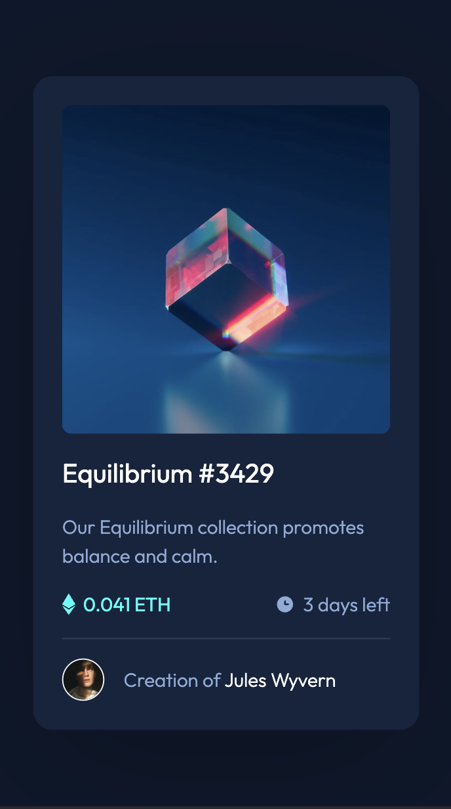
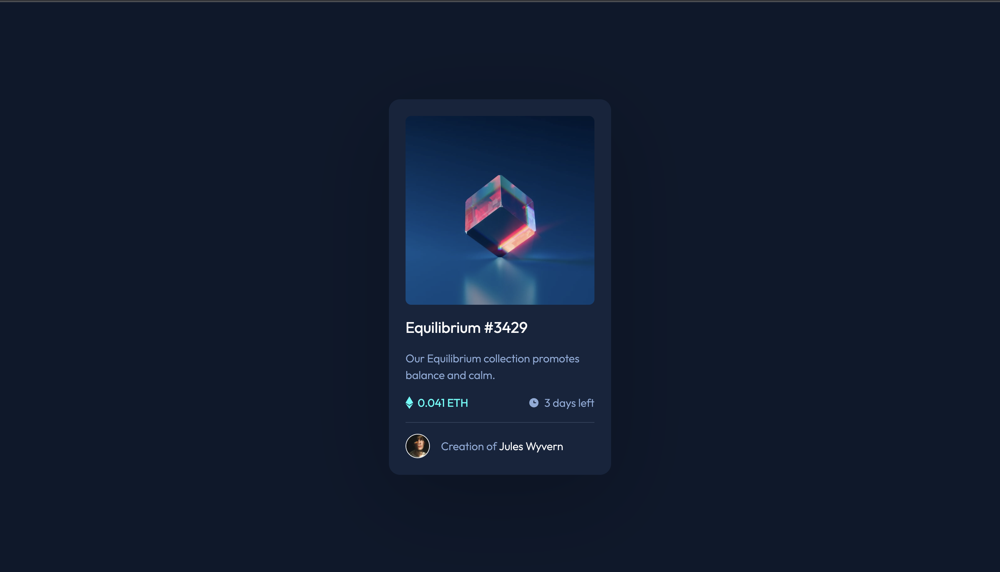

# Frontend Mentor - NFT preview card component solution

This is a solution to the [NFT preview card component challenge on Frontend Mentor](https://www.frontendmentor.io/challenges/nft-preview-card-component-SbdUL_w0U). Frontend Mentor challenges help you improve your coding skills by building realistic projects.

## Table of contents

- [Overview](#overview)
  - [The challenge](#the-challenge)
  - [Screenshot](#screenshot)
    - [Mobile](#mobile)
    - [Desktop](#desktop)
  - [Links](#links)
- [My process](#my-process)
  - [Built with](#built-with)
- [Author](#author)

## Overview

### The challenge

Users should be able to:

- View the optimal layout depending on their device's screen size
- See hover states for interactive elements

### Screenshot

#### Mobile

#### Desktop

### Links

- Solution URL: [https://www.frontendmentor.io/solutions/nft-preview-card-component-using-css-custom-properties-and-flex-box-3d2kGBM-Sd](https://www.frontendmentor.io/solutions/nft-preview-card-component-using-css-custom-properties-and-flex-box-3d2kGBM-Sd)
- Live Site URL: [https://wesselkonstantinov.github.io/nft-preview-card-component/](https://wesselkonstantinov.github.io/nft-preview-card-component/)

## My process

### Built with

- Semantic HTML5 markup
- CSS custom properties
- Flexbox
- Mobile-first workflow

## Author

- Website - [Wessel Konstantinov](https://github.com/WesselKonstantinov)
- Frontend Mentor - [@WesselKonstantinov](https://www.frontendmentor.io/profile/WesselKonstantinov)
